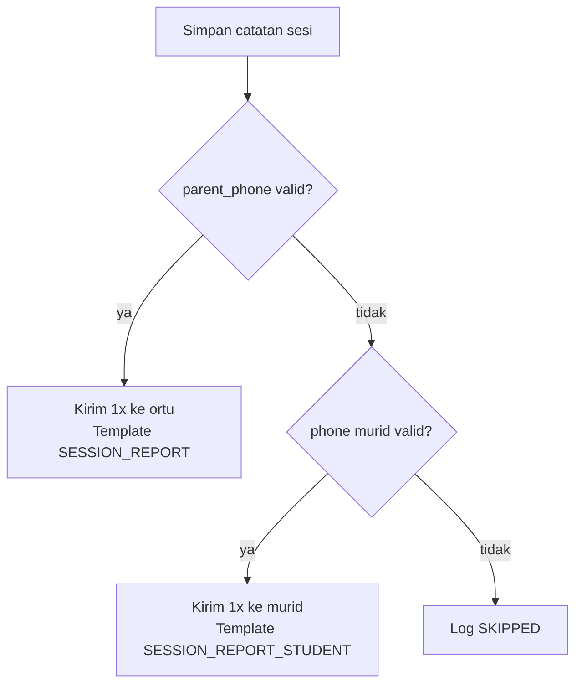

# Template Laporan Sesi WA ke Murid — Implementation Plan

> **For agentic workers:** REQUIRED SUB-SKILL: Use superpowers:subagent-driven-development (recommended) or superpowers:executing-plans to implement this plan task-by-task. Steps use checkbox (`- [ ]`) syntax for tracking.

**Goal:** Saat `parent_phone` kosong dan WA dikirim ke `phone` murid, gunakan template terpisah `SESSION_REPORT_STUDENT` dengan nada hangat (nama lengkap + "kamu"), bukan template ortu.

**Architecture:** Tambah template kedua di master data `WhatsappMessageTemplate`. `SessionReportWaService` resolve recipient type (`parent`|`student`) lalu pilih template + `{pesan_semangat}` orang kedua vs ketiga. UI guru menampilkan chip "ortu" vs "murid".

**Keputusan penerima (disetujui user):** **Satu pesan, satu nomor** — prioritas `parent_phone` → fallback `phone` murid jika ortu kosong/invalid. **TIDAK** kirim ke kedua nomor sekaligus. Template `SESSION_REPORT_STUDENT` hanya dipakai saat fallback ke murid.



**Tech Stack:** Laravel 11, PHPUnit, Blade, existing Fonnte + `SessionReportWaService`

**Design spec:** `docs/superpowers/specs/2026-06-07-session-report-wa-design.md` (section Out of Scope "Notifikasi ke murid dewasa terpisah" — sekarang diimplementasikan)

---

## File Map

**Modify:**
- `app/Models/WhatsappMessageTemplate.php` — konstanta + `defaultSessionReportStudent()`
- `database/seeders/WhatsappMessageTemplateSeeder.php` — seed `SESSION_REPORT_STUDENT`
- `app/Services/SessionReportWaService.php` — recipient type, template routing, encouragement
- `app/Http/Controllers/WhatsappMessageTemplateController.php` — protect delete
- `resources/views/whatsapp-templates/_form.blade.php` — readonly code
- `resources/views/guru/_sesi-absensi-actions.blade.php` — chip ortu/murid
- `tests/Feature/SessionReportWaTest.php` — test baru

---

### Task 1: Model + Seeder — Template Murid

**Files:**
- Modify: `app/Models/WhatsappMessageTemplate.php`
- Modify: `database/seeders/WhatsappMessageTemplateSeeder.php`
- Test: `tests/Feature/SessionReportWaTest.php`

- [ ] **Step 1: Write failing test**

```php
public function test_default_session_report_student_template_exists_after_seed(): void
{
    $this->seed(\Database\Seeders\WhatsappMessageTemplateSeeder::class);

    $template = WhatsappMessageTemplate::defaultSessionReportStudent();

    $this->assertNotNull($template);
    $this->assertSame(WhatsappMessageTemplate::CODE_SESSION_REPORT_STUDENT, $template->code);
    $this->assertTrue($template->is_active);
    $this->assertStringContainsString('{nama_murid}', $template->body);
    $this->assertStringNotContainsString('{nama_ortu}', $template->body);
}
```

- [ ] **Step 2: Run test — expect FAIL**

```bash
php artisan test --filter=test_default_session_report_student_template_exists_after_seed
```

- [ ] **Step 3: Add constant + method to model**

```php
public const CODE_SESSION_REPORT_STUDENT = 'SESSION_REPORT_STUDENT';

public static function defaultSessionReportStudent(): ?self
{
    return static::query()
        ->where('code', self::CODE_SESSION_REPORT_STUDENT)
        ->where('is_active', true)
        ->first();
}
```

- [ ] **Step 4: Add seeder entry**

```php
WhatsappMessageTemplate::firstOrCreate(
    ['code' => WhatsappMessageTemplate::CODE_SESSION_REPORT_STUDENT],
    [
        'name'       => 'Laporan Sesi ke Murid',
        'sort_order' => 4,
        'is_active'  => true,
        'body'       => <<<'TEXT'
Halo, {nama_murid}! 👋

Les *{instrumen}* kamu hari ini sudah selesai. Berikut ringkasan dari guru *{nama_guru}*:

📅 *{tanggal_sesi}*
🎹 Instrumen: {instrumen}
👨‍🏫 Guru: {nama_guru}

*Materi hari ini:*
{materi}

*Latihan di rumah:*
{tugas}

{blok_catatan}

{pesan_semangat}

Latihan rutin walau sebentar bikin beda besar — semangat ya! 💪🎶
Kalau ada yang bingung soal materi atau tugas, kabari guru lewat admin studio.

Salam,
Musik KITA
WA: {studio_wa}
TEXT,
    ],
);
```

- [ ] **Step 5: Run test — expect PASS**

```bash
php artisan test --filter=test_default_session_report_student_template_exists_after_seed
```

---

### Task 2: Service — Routing Template & Pesan Semangat

**Files:**
- Modify: `app/Services/SessionReportWaService.php`
- Test: `tests/Feature/SessionReportWaTest.php`

- [ ] **Step 1: Write failing tests**

```php
public function test_compose_message_uses_student_template_when_sent_to_student(): void
{
    ['session' => $session] = $this->buildSessionWithNote(null, '081234567890');

    $session->load(['student', 'teacher', 'enrollment.package.instrument', 'teacherNote']);
    $service = app(SessionReportWaService::class);

    WhatsappMessageTemplate::where('code', WhatsappMessageTemplate::CODE_SESSION_REPORT_STUDENT)->update([
        'body' => 'Halo {nama_murid}! Kamu les {instrumen}. {pesan_semangat}',
    ]);

    $message = $service->composeMessage($session, false, 'student');

    $this->assertStringStartsWith('Halo Ani Kecil!', $message);
    $this->assertStringContainsString('Kamu les Piano', $message);
    $this->assertStringContainsString('Kamu tampil sangat antusias', $message);
    $this->assertStringNotContainsString('Bu Siti', $message);
    $this->assertStringNotContainsString('Bapak/Ibu', $message);
}

public function test_compose_message_uses_parent_template_by_default(): void
{
    ['session' => $session] = $this->buildSessionWithNote();

    $session->load(['student', 'teacher', 'enrollment.package.instrument', 'teacherNote']);
    $message = app(SessionReportWaService::class)->composeMessage($session, false, 'parent');

    $this->assertStringContainsString('Bu Siti', $message);
    $this->assertStringContainsString('antusias dan fokus', $message);
}
```

- [ ] **Step 2: Run tests — expect FAIL**

```bash
php artisan test --filter="test_compose_message_uses_student_template|test_compose_message_uses_parent_template"
```

- [ ] **Step 3: Implement service changes**

Key changes in `SessionReportWaService`:

1. Refactor `resolveRecipientPhone()` → public `resolveRecipientType(Student $student): ?string` returning `'parent'`, `'student'`, or `null` (satu nomor saja, ortu prioritas)
2. Add `resolveRecipientPhone(Student $student): ?string` yang memanggil `resolveRecipientType()` — tidak kirim ganda
3. Change `composeMessage(ClassSession $session, bool $isUpdate = false, string $recipientType = 'parent'): string`
4. Pick template: `parent` → `defaultSessionReport()`, `student` → `defaultSessionReportStudent()`
5. `encouragementLine(?Student $student, ?int $rating, string $recipientType): string` — second person for student
6. `sendForSession()` calls `resolveRecipientType()` once → satu `fonnte->sendText()` saja

Student encouragement lines:
- 5: `Kamu tampil sangat antusias dan fokus hari ini — keren banget! Pertahankan ya, {nama}!`
- 4: `Kemajuanmu hari ini kelihatan banget. Terus semangat latihannya ya!`
- 3: `Kamu sudah berusaha dengan baik hari ini. Latihan singkat tiap hari akan bikin hasil makin terasa.`
- default: `Setiap sesi adalah langkah berharga — terus semangat ya, {nama}!`

- [ ] **Step 4: Run tests — expect PASS**

```bash
php artisan test --filter=SessionReportWaTest
```

---

### Task 3: Protect Template + UI Chip

**Files:**
- Modify: `app/Http/Controllers/WhatsappMessageTemplateController.php`
- Modify: `resources/views/whatsapp-templates/_form.blade.php`
- Modify: `resources/views/guru/_sesi-absensi-actions.blade.php`

- [ ] **Step 1: Add `SESSION_REPORT_STUDENT` to protected codes** (controller destroy + form readonly)

- [ ] **Step 2: Update guru chip**

Add helper usage in blade:
```php
$waRecipientType = $waService->resolveRecipientType($sesi->student);
$waRecipientLabel = $waRecipientType === 'student' ? 'murid' : 'ortu';
```

Change pending chip: `Akan dikirim ke {{ $waRecipientLabel }} dalam ~N menit`

- [ ] **Step 3: Expose `resolveRecipientType` as public method on service**

---

### Task 4: Full Regression

- [ ] **Step 1: Run full SessionReportWaTest suite**

```bash
php artisan test --filter=SessionReportWaTest
```

Expected: all PASS

- [ ] **Step 2: Run related tests if any break**

```bash
php artisan test --filter=WhatsappMessage
```
