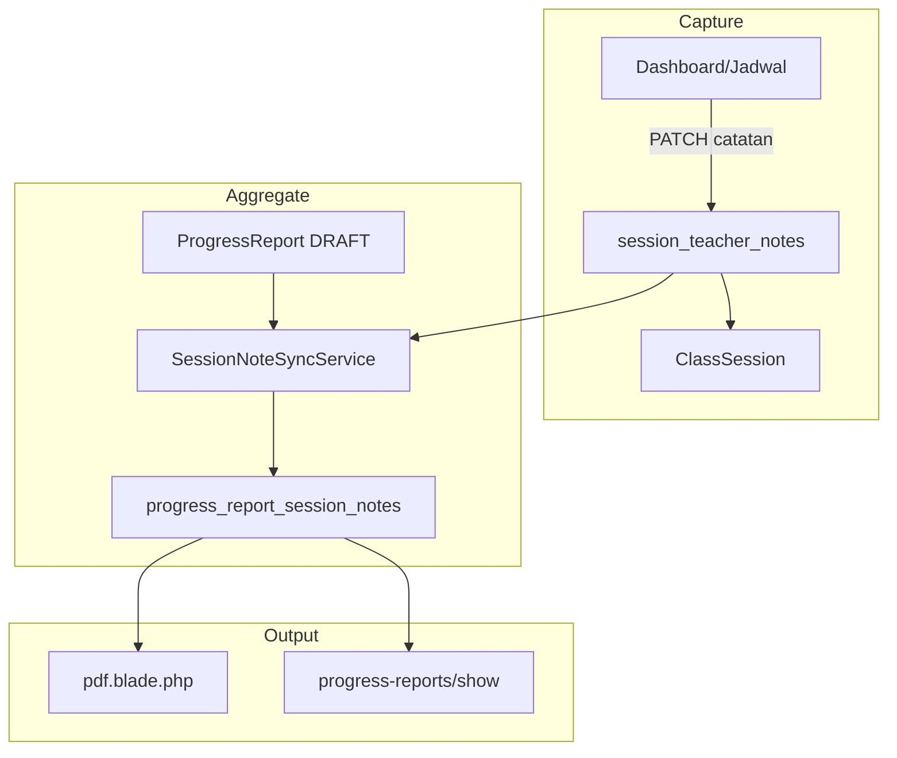

# Design: Catatan Per Sesi Guru

**Tanggal:** 2026-06-06  
**Modul:** M10 Guru Portal + M11 Laporan Progres  
**Status:** Disetujui

---

## 1. Masalah

Guru saat ini mengisi **catatan per sesi** secara manual di form laporan progress bulanan (`laporan-form.blade.php`) — tanggal + teks bebas, tanpa kait ke `ClassSession` nyata. Akibatnya:

- Guru harus mengingat kembali isi setiap sesi di akhir bulan
- Tanggal catatan bisa tidak cocok dengan sesi yang benar-benar HADIR
- `ClassSession.notes` sudah dipakai untuk operasional (reschedule/admin), bukan catatan pedagogis

## 2. Tujuan

- Guru mengisi catatan **terstruktur** langsung setelah sesi selesai (dashboard/jadwal)
- Catatan otomatis muncul **read-only** di laporan progress bulanan
- Saat laporan disubmit, catatan sesi di-snapshot ke `progress_report_session_notes` (immutable)

## 3. Keputusan Desain

| Aspek | Keputusan |
|-------|-----------|
| Arsitektur | **Opsi A** — tabel baru `session_teacher_notes` (FK `class_session_id`, unique) |
| Sync ke laporan bulanan | Auto read-only — guru edit hanya di level sesi |
| Format catatan | **Materi yang dipelajari** + **Tugas & Latihan/Persiapan 1 minggu** + **Catatan** |
| Sumber kebenaran | `session_teacher_notes`; snapshot di `progress_report_session_notes` saat sync/submit |

## 4. Data Model

### Tabel baru: `session_teacher_notes`

| Kolom | Tipe | Keterangan |
|-------|------|------------|
| `id` | bigint PK | |
| `class_session_id` | FK unique → `class_sessions` | Satu catatan per sesi |
| `teacher_id` | FK → `teachers` | Guru yang menulis |
| `material_learned` | text nullable | Materi yang dipelajari |
| `homework_notes` | text nullable | Tugas & latihan/persiapan 1 minggu ke depan |
| `notes` | text nullable | Catatan tambahan |
| `session_rating` | unsignedTinyInteger nullable | Rating 1–5 (opsional) |
| timestamps | | |

**Validasi:** minimal 1 dari 3 field harus terisi.

### Extend: `progress_report_session_notes`

| Kolom baru | Tipe |
|------------|------|
| `class_session_id` | FK nullable → `class_sessions` |
| `material_learned` | text nullable |
| `homework_notes` | text nullable |
| `session_sequence` | unsignedTinyInteger nullable |
| `session_rating` | unsignedTinyInteger nullable |

Kolom `notes` existing = catatan tambahan. Snapshot frozen saat laporan SUBMITTED.

## 6b. Kartu Laporan Sesi (Web Only)

| Aspek | Keputusan |
|-------|-----------|
| Tampilan web | Kartu formal per sesi di laporan-form guru + admin show |
| PDF bulanan | **Tidak diubah** — tetap format ringkas tanpa rating/kotak |
| Rating | Opsional 1–5 bintang; input bintang di form guru |
| Komponen | `resources/views/components/session-note-card.blade.php` |

## 5. Business Rules

### Sesi eligible untuk catatan

- Status: `HADIR`, `HADIR_TERLAMBAT`
- Sesi pengganti/reschedule: catatan di sesi pengganti (bukan sesi `IZIN_RESCHEDULE`)
- `HANGUS`, `LIBUR`, `CANCELLED`, dll.: tidak perlu catatan

### Siapa boleh menulis

- Guru utama (`teacher_id`) untuk sesi miliknya
- Guru pengganti (`substitute_teacher_id`) setelah konfirmasi hadir

### Window edit

- Selama laporan bulanan enrollment untuk bulan sesi **belum SUBMITTED**
- Setelah submit: catatan sesi bulan itu terkunci (snapshot sudah frozen)

## 6. Arsitektur

### `SessionNoteSyncService`

Dipanggil dari `laporanEdit`, `laporanUpdate` (draft + submit):

1. Query `ClassSession` untuk `enrollment_id` + month/year laporan, status HADIR/HADIR_TERLAMBAT
2. Left join `session_teacher_notes`
3. Upsert `progress_report_session_notes` by `class_session_id`
4. Hapus snapshot baris yang sesi-nya tidak lagi eligible
5. Sort by `session_date`, `start_time`

## 7. Perubahan UI

### Guru portal — setelah absensi

File: `resources/views/guru/_sesi-absensi-actions.blade.php`

- Setelah HADIR/HADIR_TERLAMBAT: collapsible form 3 field
- Route: `PATCH /guru/sesi/{classSession}/catatan`

### Form laporan bulanan — read-only kartu

File: `resources/views/guru/laporan-form.blade.php`

- Kartu per sesi via `<x-session-note-card>` (Nama, Guru, Tanggal, Rating, 3 kotak)
- Peringatan kuning jika sesi HADIR tanpa catatan teks
- Konfirmasi JS saat submit jika ada sesi tanpa catatan

### Admin show — kartu sesi

File: `resources/views/progress-reports/show.blade.php` — reuse `<x-session-note-card>`.

### PDF bulanan

File: `resources/views/progress-reports/pdf.blade.php` — **tidak diubah** (format ringkas tanpa rating/kotak).

## 8. Out of Scope v1

- Halaman dedicated `/guru/catatan-sesi`
- Banner reminder dashboard
- Auto-reminder email/WA
- Template berbeda per instrumen

## 9. File Scope

| File | Perubahan |
|------|-----------|
| Migration | `create_session_teacher_notes_table`, alter `progress_report_session_notes` |
| `app/Models/SessionTeacherNote.php` | Baru |
| `app/Models/ClassSession.php` | Relasi `teacherNote()` |
| `app/Models/ProgressReportSessionNote.php` | Fillable + relasi |
| `app/Services/SessionNoteSyncService.php` | Baru |
| `app/Http/Controllers/GuruController.php` | `updateSessionNotes`, sync, hapus manual notes |
| `routes/web.php` | Route PATCH catatan |
| `resources/views/guru/_sesi-absensi-actions.blade.php` | Form catatan |
| `resources/views/guru/laporan-form.blade.php` | Read-only kartu (`x-session-note-card`) |
| `resources/views/progress-reports/show.blade.php` | Kartu sesi admin |
| `resources/views/components/session-note-card.blade.php` | Partial kartu web |
| `resources/views/progress-reports/pdf.blade.php` | Tidak diubah (format ringkas) |
| `tests/Feature/SessionTeacherNoteTest.php` | Baru |
| `tests/Feature/ProgressReportGuruTest.php` | Extend sync tests |
